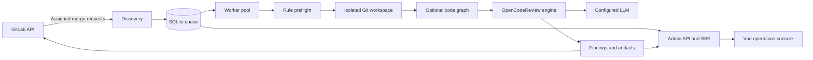

# GitLab Code Review Bot

[中文文档](README_ZH.md)

An automated AI code-review service for GitLab merge requests. It discovers merge requests assigned to a bot reviewer, reviews an immutable source/target revision in an isolated workspace, publishes findings back to GitLab, and exposes a real-time operations console.

> This project is intended for self-hosted and enterprise GitLab environments. Source code and diffs are sent to the configured LLM endpoint; choose an endpoint that satisfies your data-governance requirements.

## Console preview

The screenshots below were captured from the running service with local demonstration data. They contain no production credentials or repository content.

### Operations dashboard


### Review queue


### Findings and suggested fixes


## Features

- **GitLab-native discovery** — polls open merge requests assigned to the authenticated bot user.
- **Revision-safe reviews** — binds each job to source and target SHAs, marks superseded jobs stale, and cancels work when revisions change.
- **Isolated workspaces** — prepares per-review Git workspaces and removes them after processing.
- **AI review engine** — embeds OpenCodeReview `v1.9.2` and supports OpenAI-compatible and Anthropic-style providers.
- **Repository review rules** — loads `.opencodereview/rule.json` from the target revision; valid repository rules override the default review behavior.
- **Code graph support** — optionally builds a persistent code graph and feeds affected-file context into reviews.
- **Incremental sessions** — reuses compatible review sessions and tracks new, unfixed, and fixed findings across revisions.
- **GitLab publishing** — publishes progress, inline discussions, summary notes, and commit status results.
- **Operations console** — dashboard, review queue, finding details, coverage, revision history, quality analysis, token usage, system status, audit records, and CSV export.
- **Live updates** — Server-Sent Events refresh active jobs, findings, progress, and usage without full-page reloads.
- **Durable queue** — SQLite-backed job, event, finding, usage, and audit persistence with interrupted-job recovery.

## How it works



A worker processes each job through rule preflight, Git preparation, optional code-graph analysis, OCR review, and GitLab publication. The worker verifies the target revision throughout the run so results are never presented as belonging to a newer merge-request revision.

## Requirements

### Local development

- Go `1.25.5` or compatible Go 1.25 toolchain
- Node.js with npm
- Git
- Access to a GitLab instance
- An OpenAI-compatible or Anthropic-compatible LLM endpoint
- Optional: `code-review-graph` on `PATH` when code graph support is enabled

### GitLab token

Use a dedicated bot or project access token with the minimum permissions needed to:

- read projects, repositories, branches, and merge requests;
- read the configured review-rule file;
- publish discussions, notes, and commit statuses.

The exact GitLab role depends on instance policy. An `api`-scoped token is commonly required for publication.

## Quick start

### 1. Create a local configuration

Copy the example and keep the resulting `config.json` local; it is ignored by Git.

```bash
cp config.example.json config.json
```

On Windows Command Prompt:

```bat
copy config.example.json config.json
```

Update at least these non-secret values in `config.json`:

```json
{
  "database_path": "data/ocr-bot.db",
  "data_dir": "data",
  "gitlab": {
    "base_url": "https://gitlab.example.com",
    "poll_seconds": 30
  },
  "llm": {
    "url": "https://llm.example.com/v1/chat/completions",
    "model": "your-model",
    "use_anthropic": false,
    "language": "English"
  },
  "server": {
    "addr": ":8080"
  }
}
```

### 2. Inject credentials through environment variables

Linux/macOS:

```bash
export GITLAB_TOKEN='your-gitlab-token'
export OCR_LLM_TOKEN='your-llm-token'
# Optional management API protection:
export OCR_ADMIN_TOKEN='your-admin-token'
export OCR_ADMIN_ROLE='admin'
```

Windows PowerShell:

```powershell
$env:GITLAB_TOKEN = 'your-gitlab-token'
$env:OCR_LLM_TOKEN = 'your-llm-token'
$env:OCR_ADMIN_TOKEN = 'your-admin-token' # optional
$env:OCR_ADMIN_ROLE = 'admin'             # optional
```

### 3. Build the embedded web console

```bash
cd web
npm ci
npm run build
cd ..
```

### 4. Run the service

```bash
go run ./cmd/ocr-review-bot --config config.json
```

Open <http://localhost:8080>. Readiness is available at <http://localhost:8080/health/ready>.

On Windows, `build.bat` builds the web application, runs the Go tests, and writes `build/ocr-review-bot.exe`:

```bat
build.bat
build\ocr-review-bot.exe --config config.json
```

## Docker Compose

The supplied image builds the Vue console, Go service, and `code-review-graph` runtime. Before building, create the configuration expected by the Dockerfile:

```bash
mkdir -p build
cp config.example.json build/config-docker.json
```

Set container paths and the listen address in `build/config-docker.json`:

```json
{
  "database_path": "/data/ocr-bot.db",
  "data_dir": "/data",
  "server": { "addr": ":8080" }
}
```

Keep the remaining GitLab, review, code-graph, and LLM sections from `config.example.json`, then start the service with credentials supplied by your deployment environment:

```bash
GITLAB_TOKEN='your-gitlab-token' \
OCR_LLM_TOKEN='your-llm-token' \
docker compose up --build -d
```

The Compose file persists runtime data in the `bot-data` volume and OCR configuration in the `ocr-config` volume.

## Configuration

Configuration is loaded from `--config`, or from the path in `OCR_BOT_CONFIG`. Environment variables override selected fields.

| Environment variable | Purpose |
| --- | --- |
| `OCR_BOT_CONFIG` | Configuration-file path when `--config` is omitted |
| `GITLAB_TOKEN` | GitLab API token; required |
| `GITLAB_BASE_URL` | Overrides `gitlab.base_url` |
| `OCR_LLM_URL` | Overrides `llm.url` |
| `OCR_LLM_TOKEN` | LLM authentication token |
| `OCR_LLM_MODEL` | Overrides `llm.model` |
| `OCR_BOT_ADDR` | Overrides `server.addr` |
| `OCR_ADMIN_TOKEN` | Enables bearer-token protection for management APIs |
| `OCR_ADMIN_ROLE` | Management role: `admin`, `operator`, `viewer`, or `auditor` |

The LLM section also supports `auth_header`, `extra_headers`, `extra_body`, `timeout_seconds`, and `use_anthropic`. Review controls include worker concurrency, per-file concurrency, timeouts, blocking severities, and daily/monthly token budgets. See [`config.example.json`](config.example.json) for the maintained baseline.

## GitLab workflow

1. Create a dedicated GitLab bot account or project access token.
2. Assign the bot as a reviewer on an open, non-draft merge request.
3. The scheduler discovers the merge request and records its source and target revisions.
4. A worker reads the target-branch rule file, prepares the workspace, and runs the review.
5. Findings and progress are persisted, streamed to the console, and published back to GitLab.
6. A changed source or target revision supersedes the old job rather than mixing results across revisions.

Repository-specific rules are optional. If present, place them at:

```text
.opencodereview/rule.json
```

## HTTP endpoints

| Endpoint | Description |
| --- | --- |
| `GET /health/live` | Process liveness |
| `GET /health/ready` | SQLite-backed readiness check |
| `GET /api/v1/admin/dashboard` | Queue, result, and token summary |
| `GET /api/v1/admin/reviews` | Filtered and paginated review jobs |
| `GET /api/v1/admin/reviews/{id}` | Review metadata, findings, coverage, and publication state |
| `GET /api/v1/admin/events` | Server-Sent Events stream |
| `GET /api/v1/admin/usage/*` | Usage summary, trend, project, and model breakdowns |
| `GET /api/v1/admin/system` | Dependency and runtime status |

Management endpoints support role-based permissions when `OCR_ADMIN_TOKEN` is configured. Credentials are not returned by the admin API.

## Project structure

```text
cmd/ocr-review-bot/   Service entry point, HTTP API, quality endpoints
internal/config/      Configuration loading and environment overrides
internal/gitlab/      GitLab API client
internal/store/       SQLite queue, findings, events, usage, and audit data
internal/workspace/   Repository preparation and cleanup
internal/codegraph/   code-review-graph lifecycle and impact context
internal/review/      Embedded OpenCodeReview integration and result model
internal/worker/      Review state machine, retries, and publication orchestration
internal/ocr/         Embedded OCR agent, tools, sessions, viewer, and telemetry
web/                  Vue 3 + TypeScript operations console
docs/                 Design documents and README images
```

## Development and verification

```bash
# Backend tests
go test ./...

# Frontend type-check and production build
cd web
npm run build
```

For an end-to-end smoke test, start the service and verify both endpoints:

```bash
curl http://localhost:8080/health/ready
curl http://localhost:8080/api/v1/admin/dashboard
```

## Security notes

- Do not commit `config.json`, `.env` files, databases, logs, or runtime data.
- Prefer environment variables or a secret manager for GitLab, LLM, and admin tokens.
- Use a dedicated least-privilege GitLab identity.
- Treat source code, diffs, prompts, findings, session artifacts, and code-graph data as sensitive.
- Review the configured LLM endpoint's retention and training policy before production use.
- Protect the management API with `OCR_ADMIN_TOKEN` when it is reachable outside a trusted network.
