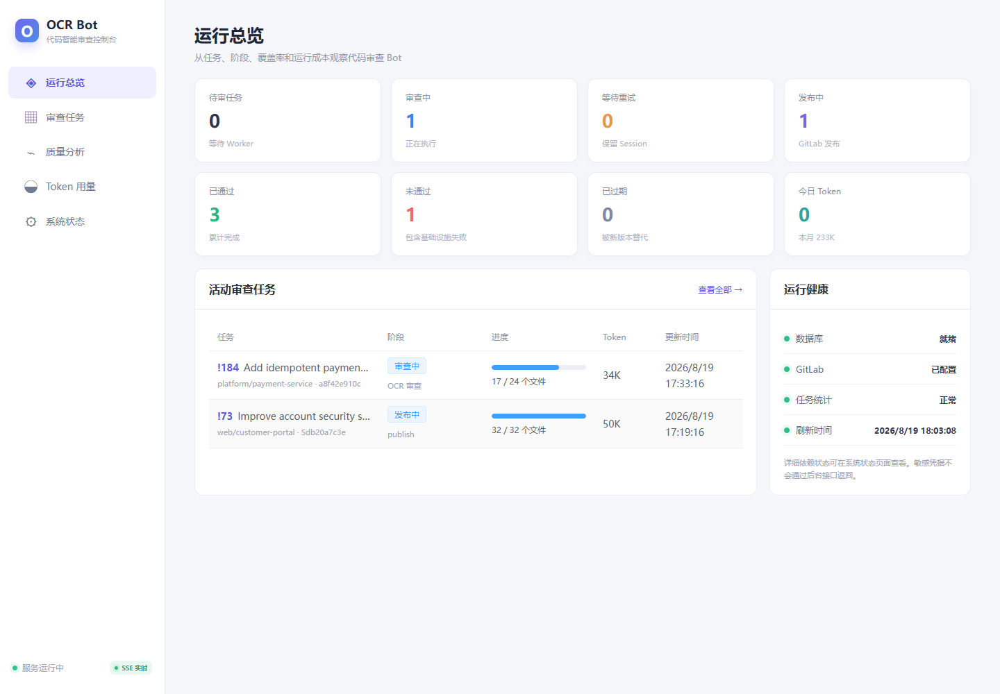
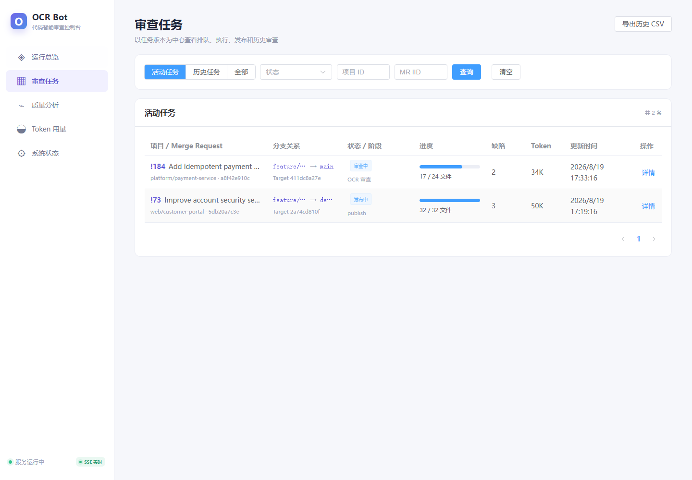
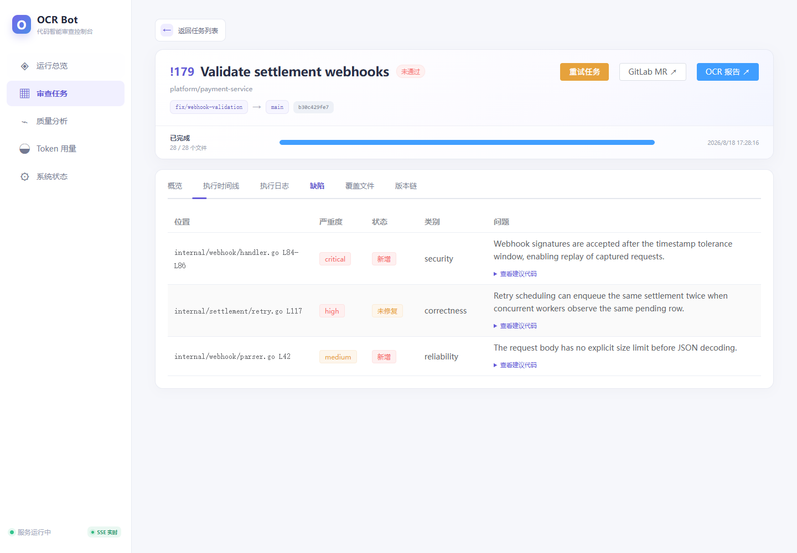
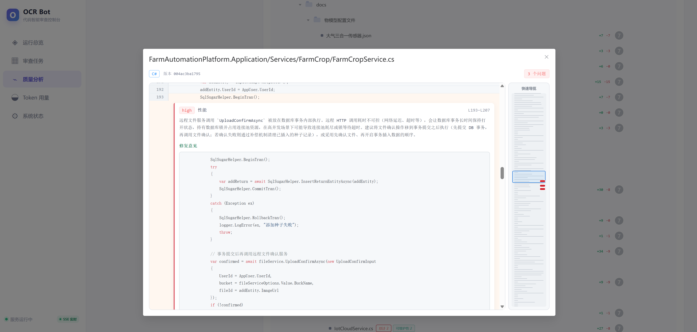
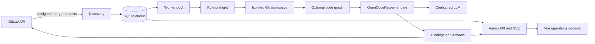

# GitLab Code Review Bot

[中文文档](README.md)

An automated AI code-review service for GitLab merge requests. It discovers merge requests assigned to a bot reviewer, reviews an immutable source/target revision in an isolated workspace, publishes findings back to GitLab, and exposes a real-time operations console.

> This project is intended for self-hosted and enterprise GitLab environments. Source code and diffs are sent to the configured LLM endpoint; choose an endpoint that satisfies your data-governance requirements.

## Console preview

The screenshots below were captured from the running service with local demonstration data. They contain no production credentials or repository content.

### Operations dashboard



### Review queue



### Findings and suggested fixes




## Features

- **GitLab-native discovery** — polls open merge requests assigned to the authenticated bot user.
- **Revision-safe reviews** — binds each job to source and target SHAs, marks superseded jobs stale, and cancels work when revisions change.
- **Isolated workspaces** — prepares per-review Git workspaces and removes them after processing.
- **AI review engine** — embeds OpenCodeReview `v1.9.2` and supports OpenAI-compatible and Anthropic-style providers.
- **Repository review rules** — loads `.opencodereview/rule.json` from the target revision; valid repository rules override the default review behavior.
- **Code graph support** — optionally builds a persistent code graph and feeds affected-file context into reviews.
- **Incremental sessions** — reuses compatible review sessions and tracks new, unfixed, and fixed findings across revisions.
- **GitLab publishing** — publishes progress, inline discussions, summary notes, and commit status results.
- **Operations console** — dashboard, review queue, finding details, coverage, revision history, quality analysis, token usage, system status, audit records, and CSV export.
- **Live updates** — Server-Sent Events refresh active jobs, findings, progress, and usage without full-page reloads.
- **Durable queue** — SQLite-backed job, event, finding, usage, and audit persistence with interrupted-job recovery.

## How it works



A worker processes each job through rule preflight, Git preparation, optional code-graph analysis, OCR review, and GitLab publication. The worker verifies the target revision throughout the run so results are never presented as belonging to a newer merge-request revision.

## Requirements

### Local development

- Go `1.25.5` or compatible Go 1.25 toolchain
- Node.js with npm
- Git
- Access to a GitLab instance
- An OpenAI-compatible or Anthropic-compatible LLM endpoint
- Optional: `code-review-graph` on `PATH` when code graph support is enabled

### GitLab Bot account and token

Create a dedicated GitLab Bot account and generate a personal access token from that account. Select exactly these token scopes:

```text
[x] api
[x] read_repository
[x] read_user
```

Add the Bot account to the top-level GitLab group that contains the projects to review and set its role to **Reporter**. The Reporter role is then inherited by projects under that group. For projects outside the group, add the Bot account to each project separately with the **Reporter** role.

These permissions allow the service to read projects, repositories, users, branches, merge requests, and review rules, and to publish discussions, notes, and commit statuses through the GitLab API. Do not grant the Bot account a higher project role unless your GitLab instance policy requires it.

## Quick start

### 1. Create a local configuration

Copy the example and keep the resulting `config.json` local; it is ignored by Git.

```bash
cp config.example.json config.json
```

On Windows Command Prompt:

```bat
copy config.example.json config.json
```

Update at least these non-secret values in `config.json`:

```json
{
  "database_path": "data/ocr-bot.db",
  "data_dir": "data",
  "gitlab": {
    "base_url": "https://gitlab.example.com",
    "poll_seconds": 30
  },
  "review": {
    "viewer_url": "https://reviews.example.com"
  },
  "llm": {
    "url": "https://llm.example.com/v1/chat/completions",
    "model": "your-model",
    "use_anthropic": false,
    "language": "English"
  },
  "server": {
    "addr": ":8080"
  }
}
```

### 2. Inject credentials through environment variables

Linux/macOS:

```bash
export GITLAB_TOKEN='your-gitlab-token'
export OCR_LLM_TOKEN='your-llm-token'
# Optional management API protection:
export OCR_ADMIN_TOKEN='your-admin-token'
export OCR_ADMIN_ROLE='admin'
```

Windows PowerShell:

```powershell
$env:GITLAB_TOKEN = 'your-gitlab-token'
$env:OCR_LLM_TOKEN = 'your-llm-token'
$env:OCR_ADMIN_TOKEN = 'your-admin-token' # optional
$env:OCR_ADMIN_ROLE = 'admin'             # optional
```

### 3. Build the embedded web console

```bash
cd web
npm ci
npm run build
cd ..
```

### 4. Run the service

```bash
go run ./cmd/ocr-review-bot --config config.json
```

Open <http://localhost:8080>. Readiness is available at <http://localhost:8080/health/ready>.

On Windows, `build.bat` builds the web application, runs the Go tests, and writes `build/ocr-review-bot.exe`:

```bat
build.bat
build\ocr-review-bot.exe --config config.json
```

## Docker Compose

### Deploy the published GHCR image

The latest image is published at `ghcr.io/ghluuuuuu/gitlab-code-review-bot:latest`. Create a deployment directory and download the example configuration:

```bash
mkdir -p ocr-review-bot
cd ocr-review-bot
curl -fsSL https://raw.githubusercontent.com/ghluuuuuu/gitlab-code-review-bot/main/config.example.json -o config.json
```

Edit `config.json`. At minimum, use container paths, your GitLab URL, and your LLM endpoint and model; keep the remaining sections from the downloaded example:

```json
{
  "database_path": "/data/ocr-bot.db",
  "data_dir": "/data",
  "gitlab": {
    "base_url": "https://gitlab.example.com",
    "poll_seconds": 30
  },
  "review": {
    "viewer_url": "https://reviews.example.com"
  },
  "llm": {
    "url": "https://llm.example.com/v1/chat/completions",
    "model": "your-model",
    "use_anthropic": false,
    "language": "English"
  },
  "server": { "addr": ":8080" }
}
```

Create `compose.yml`:

```yaml
name: ocr-review-bot
services:
  ocr-review-bot:
    image: ghcr.io/ghluuuuuu/gitlab-code-review-bot:latest
    pull_policy: always
    container_name: ocr-review-bot
    restart: unless-stopped
    ports:
      - "8080:8080"
    volumes:
      - bot-data:/data
      - ocr-config:/root/.opencodereview
      - ./config.json:/app/config.json:ro
    environment:
      GITLAB_TOKEN: ${GITLAB_TOKEN:?set GITLAB_TOKEN}
      OCR_LLM_TOKEN: ${OCR_LLM_TOKEN:?set OCR_LLM_TOKEN}
      OCR_ADMIN_TOKEN: ${OCR_ADMIN_TOKEN:-}
      OCR_ADMIN_ROLE: ${OCR_ADMIN_ROLE:-admin}

volumes:
  bot-data:
  ocr-config:
```

Create a local `.env` file for credentials. Do not commit this file:

```dotenv
GITLAB_TOKEN=your-gitlab-bot-token
OCR_LLM_TOKEN=your-llm-token
OCR_ADMIN_TOKEN=replace-with-a-strong-admin-token
OCR_ADMIN_ROLE=admin
```

Start the service and verify readiness:

```bash
chmod 600 .env
docker compose pull
docker compose up -d
curl -fsS http://localhost:8080/health/ready
```

Open <http://localhost:8080>. To update to a newer `latest` image, run `docker compose pull && docker compose up -d` again. The named volumes preserve the SQLite database and OCR configuration across container replacements.


```bash
echo "$GHCR_TOKEN" | docker login ghcr.io -u YOUR_GITHUB_USERNAME --password-stdin
```

### Build the image locally

Before building from the repository, create the configuration expected by the Dockerfile:

```bash
mkdir -p build
cp config.example.json build/config-docker.json
```

Set `database_path` to `/data/ocr-bot.db`, `data_dir` to `/data`, and `server.addr` to `:8080` in `build/config-docker.json`. Keep the remaining GitLab, review, code-graph, and LLM sections from `config.example.json`, then build and start the service with credentials supplied by your deployment environment:

```bash
GITLAB_TOKEN='your-gitlab-token' \
OCR_LLM_TOKEN='your-llm-token' \
docker compose up --build -d
```

The Compose file persists runtime data in the `bot-data` volume and OCR configuration in the `ocr-config` volume.

## Configuration

Configuration is loaded from `--config`, or from the path in `OCR_BOT_CONFIG`. Environment variables override selected fields.

| Environment variable | Purpose |
| --- | --- |
| `OCR_BOT_CONFIG` | Configuration-file path when `--config` is omitted |
| `GITLAB_TOKEN` | GitLab API token; required |
| `GITLAB_BASE_URL` | Overrides `gitlab.base_url` |
| `OCR_VIEWER_URL` | Overrides `review.viewer_url`; review-report links in GitLab comments point to the quality page under this base URL |
| `OCR_AUTH_ENABLED` | Enables the account system (`true` or `1`) |
| `OCR_BOOTSTRAP_ADMIN_USERNAME` | Superadmin username created on first startup |
| `OCR_BOOTSTRAP_ADMIN_EMAIL` | Superadmin email created on first startup |
| `OCR_BOOTSTRAP_ADMIN_PASSWORD` | Initial superadmin password; at least 10 characters |
| `OCR_OIDC_ISSUER_URL` | Optional OIDC issuer; setting it enables OIDC |
| `OCR_OIDC_CLIENT_ID` | OIDC client ID |
| `OCR_OIDC_CLIENT_SECRET` | OIDC client secret |
| `OCR_OIDC_REDIRECT_URL` | OIDC callback URL; defaults to `{viewer_url}/api/v1/auth/oidc/callback` |
| `OCR_LLM_URL` | Overrides `llm.url` |
| `OCR_LLM_TOKEN` | LLM authentication token |
| `OCR_LLM_MODEL` | Overrides `llm.model` |
| `OCR_BOT_ADDR` | Overrides `server.addr` |
| `OCR_ADMIN_TOKEN` | Enables bearer-token protection for management APIs |
| `OCR_ADMIN_ROLE` | Management role: `admin`, `operator`, `viewer`, or `auditor` |

The LLM section also supports `auth_header`, `extra_headers`, `extra_body`, `timeout_seconds`, and `use_anthropic`. Review controls include worker concurrency, per-file concurrency, timeouts, blocking severities, and daily/monthly token budgets. In production, set `review.viewer_url` (or `OCR_VIEWER_URL`) to the user-accessible public service base URL; GitLab comments automatically link to `/quality?project_id=…&mr_iid=…`. See [`config.example.json`](config.example.json) for the maintained baseline.

The account system is enabled by default. On first startup with an empty user database, the browser only shows Initial Superadmin Setup; the console remains inaccessible until the first superadmin is created. Alternatively, configure `bootstrap_admin` or `OCR_BOOTSTRAP_ADMIN_*` to create it during startup. Passwords are stored as bcrypt hashes and sessions use HttpOnly, SameSite cookies. A regular user's account email is matched exactly to a GitLab user email, then effective project membership is checked; only authorized projects can be viewed or managed. Superadmins can access User Management and System Configuration. The configuration page covers every `config.json` field; saved changes require a service restart. On first OIDC login, email and username are read from the ID token and a regular account is automatically registered when enabled.

The MCP Integration page generates a per-user Streamable HTTP configuration. Put the generated `mcpServers` JSON into the local coding-agent configuration. The agent must first run `git remote get-url origin`, `git branch --show-current`, and `git rev-parse HEAD`, then call `get_current_branch_issues` or `get_file_issues`. The MCP service enforces project access using the user's token and GitLab email membership.

## GitLab workflow

1. Create the dedicated GitLab Bot account, personal access token, and Reporter membership described above.
2. Assign the bot as a reviewer on an open, non-draft merge request.
3. The scheduler discovers the merge request and records its source and target revisions.
4. A worker reads the target-branch rule file, prepares the workspace, and runs the review.
5. Findings and progress are persisted, streamed to the console, and published back to GitLab.
6. A changed source or target revision supersedes the old job rather than mixing results across revisions.

Repository-specific rules are optional. If present, place them at:

```text
.opencodereview/rule.json
```

## HTTP endpoints

| Endpoint | Description |
| --- | --- |
| `GET /health/live` | Process liveness |
| `GET /health/ready` | SQLite-backed readiness check |
| `GET /api/v1/admin/dashboard` | Queue, result, and token summary |
| `GET /api/v1/admin/reviews` | Filtered and paginated review jobs |
| `GET /api/v1/admin/reviews/{id}` | Review metadata, findings, coverage, and publication state |
| `GET /api/v1/admin/events` | Server-Sent Events stream |
| `GET /api/v1/admin/usage/*` | Usage summary, trend, project, and model breakdowns |
| `GET /api/v1/admin/system` | Dependency and runtime status |

Management endpoints support role-based permissions when `OCR_ADMIN_TOKEN` is configured. Credentials are not returned by the admin API.

## Project structure

```text
cmd/ocr-review-bot/   Service entry point, HTTP API, quality endpoints
internal/config/      Configuration loading and environment overrides
internal/gitlab/      GitLab API client
internal/store/       SQLite queue, findings, events, usage, and audit data
internal/workspace/   Repository preparation and cleanup
internal/codegraph/   code-review-graph lifecycle and impact context
internal/review/      Embedded OpenCodeReview integration and result model
internal/worker/      Review state machine, retries, and publication orchestration
internal/ocr/         Embedded OCR agent, tools, sessions, viewer, and telemetry
web/                  Vue 3 + TypeScript operations console
docs/                 Design documents and README images
```

## Development and verification

```bash
# Backend tests
go test ./...

# Frontend type-check and production build
cd web
npm run build
```

For an end-to-end smoke test, start the service and verify both endpoints:

```bash
curl http://localhost:8080/health/ready
curl http://localhost:8080/api/v1/admin/dashboard
```

## Security notes

- Do not commit `config.json`, `.env` files, databases, logs, or runtime data.
- Prefer environment variables or a secret manager for GitLab, LLM, and admin tokens.
- Use a dedicated least-privilege GitLab identity.
- Treat source code, diffs, prompts, findings, session artifacts, and code-graph data as sensitive.
- Review the configured LLM endpoint's retention and training policy before production use.
- Protect the management API with `OCR_ADMIN_TOKEN` when it is reachable outside a trusted network.


## License

This project uses a personal-use and enterprise licensing model:

- **Personal use** — individuals acting only on their own behalf may use the project for non-commercial personal purposes under the Apache License 2.0 terms plus the Personal Use limitation in [`LICENSE`](LICENSE).
- **Enterprise or organizational use** — any use by, for, or on behalf of a company or other organization, including evaluation and proof-of-concept use, requires a separate written enterprise license before use begins. Contact the repository owner or maintainer through the repository hosting page.
- **Separately licensed code** — third-party components keep their own licenses. In particular, [`internal/ocr/`](internal/ocr/) remains under its separate Apache License 2.0.

Because the personal license adds a use limitation, the project as a whole is **not** offered under the unmodified Apache License 2.0 and must not be identified solely as `Apache-2.0`. See [`LICENSE`](LICENSE) for the controlling terms.