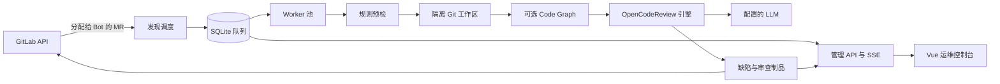

# GitLab Code Review Bot

[English](README.md)

面向 GitLab Merge Request 的自动化 AI 代码审查服务。它会发现分配给 Bot Reviewer 的 MR，在隔离工作区中对固定的源/目标版本执行审查，将问题发布回 GitLab，并提供实时运维控制台。

> 本项目适合自托管或企业 GitLab 环境。源码与 Diff 会发送到配置的 LLM 服务，请选择满足组织数据治理要求的模型端点。

## 控制台预览

以下截图来自实际运行的服务，并使用本地模拟数据生成；截图不包含生产凭据或真实仓库内容。

### 运行总览


### 审查队列


### 缺陷与建议修复


## 核心能力

- **GitLab 原生发现**：轮询分配给当前 Bot 用户的开放 MR。
- **版本安全审查**：任务绑定 source/target SHA；版本变化后将旧任务标记为 stale，并停止过期执行。
- **隔离工作区**：为每次审查准备独立 Git 工作区，处理结束后自动清理。
- **AI 审查引擎**：内嵌 OpenCodeReview `v1.9.2`，支持 OpenAI 兼容和 Anthropic 风格的模型服务。
- **仓库级审查规则**：从目标版本读取 `.opencodereview/rule.json`；有效规则会覆盖默认审查行为。
- **Code Graph**：可选构建持久化代码图，并将影响文件上下文提供给审查流程。
- **增量 Session**：复用兼容的历史审查 Session，跨版本跟踪新增、未修复和已修复问题。
- **GitLab 发布**：发布实时进度、行内 Discussion、摘要 Note 和 Commit Status。
- **运维控制台**：包含运行总览、任务队列、缺陷、覆盖率、版本链、质量分析、Token 用量、系统状态、审计记录和 CSV 导出。
- **实时更新**：通过 Server-Sent Events 推送任务、进度、问题和用量变化，无需整页刷新。
- **持久化任务队列**：使用 SQLite 保存任务、事件、缺陷、Token 和审计数据，并支持中断任务恢复。

## 工作流程



Worker 依次执行规则预检、Git 准备、可选代码图分析、OCR 审查和 GitLab 发布。执行期间持续校验目标版本，避免将旧版本的结果错误归属到新的 MR Revision。

## 环境要求

### 本地运行

- Go `1.25.5` 或兼容的 Go 1.25 工具链
- Node.js 和 npm
- Git
- 可访问的 GitLab 实例
- OpenAI 兼容或 Anthropic 兼容的 LLM 服务
- 可选：启用 Code Graph 时，`PATH` 中需要 `code-review-graph`

### GitLab Token

建议使用独立 Bot 账号或 Project Access Token，并只授予以下操作所需的最小权限：

- 读取项目、仓库、分支和 MR；
- 读取目标分支中的审查规则；
- 发布 Discussion、Note 和 Commit Status。

具体 GitLab 角色取决于实例权限策略；发布场景通常需要带 `api` scope 的 Token。

## 快速开始

### 1. 创建本地配置

复制示例配置。生成的 `config.json` 已被 Git 忽略，不会意外提交。

```bash
cp config.example.json config.json
```

Windows 命令提示符：

```bat
copy config.example.json config.json
```

至少修改 `config.json` 中的以下非敏感配置：

```json
{
  "database_path": "data/ocr-bot.db",
  "data_dir": "data",
  "gitlab": {
    "base_url": "https://gitlab.example.com",
    "poll_seconds": 30
  },
  "llm": {
    "url": "https://llm.example.com/v1/chat/completions",
    "model": "your-model",
    "use_anthropic": false,
    "language": "中文"
  },
  "server": {
    "addr": ":8080"
  }
}
```

### 2. 通过环境变量注入凭据

Linux/macOS：

```bash
export GITLAB_TOKEN='your-gitlab-token'
export OCR_LLM_TOKEN='your-llm-token'
# 可选：保护后台管理 API
export OCR_ADMIN_TOKEN='your-admin-token'
export OCR_ADMIN_ROLE='admin'
```

Windows PowerShell：

```powershell
$env:GITLAB_TOKEN = 'your-gitlab-token'
$env:OCR_LLM_TOKEN = 'your-llm-token'
$env:OCR_ADMIN_TOKEN = 'your-admin-token' # 可选
$env:OCR_ADMIN_ROLE = 'admin'             # 可选
```

### 3. 构建内嵌前端

```bash
cd web
npm ci
npm run build
cd ..
```

### 4. 启动服务

```bash
go run ./cmd/ocr-review-bot --config config.json
```

打开 <http://localhost:8080>。就绪检查地址为 <http://localhost:8080/health/ready>。

Windows 可通过 `build.bat` 构建前端、执行 Go 测试并生成 `build/ocr-review-bot.exe`：

```bat
build.bat
build\ocr-review-bot.exe --config config.json
```

## Docker Compose

项目镜像包含 Vue 控制台、Go 服务和 `code-review-graph` 运行环境。构建前先创建 Dockerfile 需要的配置：

```bash
mkdir -p build
cp config.example.json build/config-docker.json
```

在 `build/config-docker.json` 中设置容器路径和监听地址：

```json
{
  "database_path": "/data/ocr-bot.db",
  "data_dir": "/data",
  "server": { "addr": ":8080" }
}
```

保留 `config.example.json` 中其余 GitLab、Review、Code Graph 和 LLM 配置，然后由部署环境注入凭据并启动：

```bash
GITLAB_TOKEN='your-gitlab-token' \
OCR_LLM_TOKEN='your-llm-token' \
docker compose up --build -d
```

Compose 会使用 `bot-data` Volume 持久化运行数据，并使用 `ocr-config` Volume 保存 OCR 配置。

## 配置说明

服务优先读取 `--config` 指定的文件；未指定时读取 `OCR_BOT_CONFIG` 指向的文件。部分字段可由环境变量覆盖。

| 环境变量 | 用途 |
| --- | --- |
| `OCR_BOT_CONFIG` | 未传入 `--config` 时使用的配置文件路径 |
| `GITLAB_TOKEN` | GitLab API Token，必填 |
| `GITLAB_BASE_URL` | 覆盖 `gitlab.base_url` |
| `OCR_LLM_URL` | 覆盖 `llm.url` |
| `OCR_LLM_TOKEN` | LLM 鉴权 Token |
| `OCR_LLM_MODEL` | 覆盖 `llm.model` |
| `OCR_BOT_ADDR` | 覆盖 `server.addr` |
| `OCR_ADMIN_TOKEN` | 为管理 API 启用 Bearer Token 保护 |
| `OCR_ADMIN_ROLE` | 管理角色：`admin`、`operator`、`viewer` 或 `auditor` |

LLM 配置还支持 `auth_header`、`extra_headers`、`extra_body`、`timeout_seconds` 和 `use_anthropic`。审查配置支持 Worker 并发、文件并发、超时、阻断严重度以及每日/月度 Token 预算。维护中的完整基线见 [`config.example.json`](config.example.json)。

## GitLab 使用流程

1. 创建专用 GitLab Bot 账号或 Project Access Token。
2. 将 Bot 设置为开放、非 Draft MR 的 Reviewer。
3. Scheduler 发现 MR，并记录 source/target Revision。
4. Worker 读取目标分支规则，准备隔离工作区并执行审查。
5. 缺陷和进度写入 SQLite、实时推送到控制台，并发布回 GitLab。
6. source 或 target Revision 变化时，旧任务会被替代，不会混用不同版本的结果。

仓库级规则是可选的。如需使用，请放置在：

```text
.opencodereview/rule.json
```

## HTTP 接口

| 接口 | 说明 |
| --- | --- |
| `GET /health/live` | 进程存活检查 |
| `GET /health/ready` | 基于 SQLite 的就绪检查 |
| `GET /api/v1/admin/dashboard` | 队列、结果和 Token 汇总 |
| `GET /api/v1/admin/reviews` | 可筛选、分页的审查任务 |
| `GET /api/v1/admin/reviews/{id}` | 审查元数据、问题、覆盖率和发布状态 |
| `GET /api/v1/admin/events` | Server-Sent Events 实时事件流 |
| `GET /api/v1/admin/usage/*` | 用量汇总、趋势、项目和模型统计 |
| `GET /api/v1/admin/system` | 依赖和运行状态 |

配置 `OCR_ADMIN_TOKEN` 后，管理接口会启用基于角色的权限控制。管理 API 不会返回敏感凭据。

## 项目结构

```text
cmd/ocr-review-bot/   服务入口、HTTP API、质量分析接口
internal/config/      配置加载与环境变量覆盖
internal/gitlab/      GitLab API Client
internal/store/       SQLite 队列、缺陷、事件、用量和审计数据
internal/workspace/   仓库准备与清理
internal/codegraph/   code-review-graph 生命周期与影响上下文
internal/review/      内嵌 OpenCodeReview 集成和结果模型
internal/worker/      审查状态机、重试与发布编排
internal/ocr/         内嵌 OCR Agent、工具、Session、Viewer 和遥测
web/                  Vue 3 + TypeScript 运维控制台
docs/                 设计文档和 README 图片
```

## 开发与验证

```bash
# 后端测试
go test ./...

# 前端类型检查与生产构建
cd web
npm run build
```

端到端冒烟验证：启动服务后检查以下接口。

```bash
curl http://localhost:8080/health/ready
curl http://localhost:8080/api/v1/admin/dashboard
```

## 安全建议

- 不要提交 `config.json`、`.env`、数据库、日志或运行时数据。
- GitLab、LLM 和管理 Token 应通过环境变量或 Secret Manager 注入。
- 使用专用、最小权限的 GitLab 身份。
- 将源码、Diff、Prompt、缺陷、Session 制品和 Code Graph 数据视为敏感信息。
- 生产使用前确认 LLM 服务的数据留存和模型训练策略。
- 管理后台可被非可信网络访问时，必须配置 `OCR_ADMIN_TOKEN`。


## 授权许可

本项目采用个人使用与企业使用分开的授权模式：

- **个人使用**：仅以个人身份、仅用于非商业个人目的时，可依据 Apache License 2.0 条款及 [`LICENSE`](LICENSE) 中的“个人使用”附加限制使用本项目。
- **企业或组织使用**：公司或其他组织直接使用，或任何人为公司/组织利益而使用（包括内部评估和 PoC），均须在使用前另行取得书面企业授权。请通过代码托管平台联系仓库所有者或维护者。
- **独立授权代码**：第三方组件继续适用其各自的许可证；其中 [`internal/ocr/`](internal/ocr/) 仍单独遵循 Apache License 2.0。

由于个人许可证包含用途限制，项目整体并非无附加限制的 Apache License 2.0 开源项目，也不应仅标记为 `Apache-2.0`。完整且具约束力的条款以 [`LICENSE`](LICENSE) 为准。