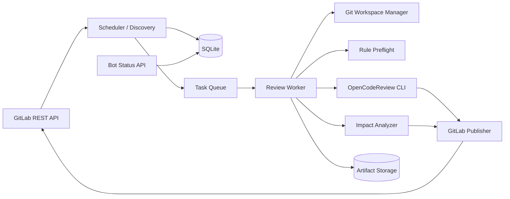

# OCR Review Bot 技术架构方案

> 目标：建设一个独立的 `ocr-review-bot` 服务，不要求每个项目配置 Webhook。服务定时查询 GitLab 中分配给 Bot 账号的待审 Merge Request（MR），读取项目目录中的强制评审规则，运行 Alibaba OpenCodeReview，输出行级代码评论、影响范围、汇总报告和绑定提交 SHA 的外部状态。
>
> 核心门禁：项目中没有有效评审规则时，**不得调用 LLM 评审，直接判定审查不通过**。

## 1. 结论

采用 **GitLab Bot 账号 + 定时发现器 + SQLite 任务状态库/队列 + OpenCodeReview CLI + GitLab API**：

```text
GitLab 中将 ocr-review-bot 指定为 Reviewer
                     ↓
Scheduler 每 30~60 秒查询 reviews_for_me
                     ↓
发现新 MR 或新的 head SHA
                     ↓
读取 MR 目标分支/当前 head SHA/项目规则
                     ↓
规则预检
  ├─ 缺失/无效 → 不调用 LLM，发布失败汇总，Commit Status=failed
  └─ 有效       → 计算 merge-base，运行 OCR
                                      ↓
                           输出代码审查 + 影响范围
                                      ↓
                    GitLab Discussion + Summary Note
                                      ↓
                         Commit Status success/failed
```

适用场景：多个项目统一接入，开发者通过“指定 OCR Bot 为 Reviewer”显式申请审查，规则和责任仍由各项目维护。

## 2. 设计原则

1. **无项目 Webhook**：服务只依赖 GitLab REST API 定时查询。
2. **Reviewer 即开关**：只有当前 Reviewer 列表包含 Bot 的 opened MR 才进入候选集。
3. **规则强制存在**：固定从项目仓库读取规则文件；缺失、空规则或格式错误均直接失败。
4. **审查绑定 SHA**：任务、报告、评论和门禁都绑定 MR 当前 `head_sha`，禁止用 MR IID 代表版本。
5. **新提交自动重审**：Bot 仍是 Reviewer 且 `head_sha` 改变时，自动创建新审查任务。
6. **旧结果不覆盖新代码**：发布前再次读取 MR；若 head 已变化，旧任务标记 stale，不发布。
7. **确定性优先**：分支基线、文件列表、规则检查、影响范围清单和门禁由程序确定；LLM 负责代码问题与语义解释。
8. **只读源码**：服务不执行 MR 中的构建脚本，不自动修改或提交代码。

## 3. 总体架构



### 3.1 组件职责

| 组件 | 职责 |
|---|---|
| Scheduler | 周期查询分配给 Bot 的 opened MR，分页、增量游标、发现新 SHA |
| GitLab Client | MR、项目、版本、Discussion、Note、Commit Status API 封装 |
| SQLite | MR 快照、任务队列、审查结果、评论映射、Token 用量、审计和调度游标 |
| Task Queue | 解耦发现和长时间 OCR 运行，控制并发与重试 |
| Worker | 执行规则预检、Git 拉取、OCR、影响分析、发布和状态回写 |
| Workspace Manager | 为每个任务创建隔离临时仓库，按 source/target SHA fetch |
| Rule Preflight | 强制读取、校验项目规则；失败时短路 LLM |
| Impact Analyzer | 确定性输出文件、模块、服务、API、数据库、配置、测试范围 |
| Publisher | 行级 Discussion、sticky Summary Note、Commit Status、幂等去重 |
| Status API | 给发测流水线查询某个 head SHA 的审查状态（可选） |
| Artifact Storage | 保存 OCR JSON、影响报告、Markdown 和 stderr |

## 4. Bot 账号和权限

创建独立 GitLab 账号：

```text
username: ocr-review-bot
name:     OpenCodeReview Bot
```

建议将 Bot 加入目标 Group，使它能读取组内所有需审查项目，并可被选为 Reviewer。

### 4.1 Token

推荐使用 Bot 账号的 Access Token：

- Scope：`api`。
- 角色：能读取仓库/MR并发布 Discussion/Note；通常 Developer，按实例权限验证后取最小权限。
- 只存服务端 Secret Manager/Kubernetes Secret。
- 禁止进入命令参数、日志、数据库明文字段和制品。

### 4.2 可见范围就是发现范围

全局接口只返回认证账号可访问的 MR。因此接入一个项目的操作是：

1. 项目位于 Bot 已加入的 Group，或单独将 Bot 加入项目。
2. 项目仓库提交强制规则文件。
3. MR 创建者将 `ocr-review-bot` 指定为 Reviewer。

不配置 Webhook，也不必在每个项目复制 CI 审查 Job。

## 5. 定时发现机制

### 5.1 首选查询

以 Bot Token 调用：

```http
GET /api/v4/merge_requests
    ?scope=reviews_for_me
    &state=opened
    &order_by=updated_at
    &sort=asc
    &per_page=100
```

当前实现显式指定由 Token 当前用户 API 返回的 Bot ID：

```http
GET /api/v4/merge_requests
    ?scope=all
    &state=opened
    &reviewer_id=<GET /api/v4/user 返回的 id>
    &updated_after=<安全重叠窗口>
    &order_by=updated_at
    &sort=asc
    &per_page=100
```

服务启动时调用 `GET /api/v4/user` 获取 Token 对应的 Bot ID，再使用 `scope=all&reviewer_id=<id>` 查询 MR；Bot ID 不允许通过配置文件或环境变量指定。

### 5.2 调度周期

- 默认每 30 秒轮询。
- 小规模可设 60 秒；大量项目建议 15~30 秒并使用增量窗口。
- 单体进程内 Scheduler 单实例运行；不部署多副本，不需要分布式锁。进程重启后从 SQLite 调度游标继续扫描，并依靠重叠窗口和幂等键防止漏检/重复。
- 所有列表请求必须处理 GitLab 分页，不允许只读第一页。

### 5.3 增量窗口

维护 `last_poll_started_at`，下一次查询使用：

```text
updated_after = last_poll_started_at - 5 minutes
```

保留 5 分钟重叠窗口，防止时钟偏差、分页期间更新和临时网络失败造成漏检。重复记录由幂等键消除。

每 6 小时执行一次全量 reconciliation：不传 `updated_after`，重新扫描 Bot 当前全部 opened MR，修复漏检、Bot 被移除、MR 已关闭等状态漂移。

### 5.4 候选确认

列表接口返回后，再获取单个 MR 最新状态：

```http
GET /api/v4/projects/:project_id/merge_requests/:mr_iid
```

只有同时满足以下条件才创建任务：

- `state == opened`
- `draft == false`（默认；可配置是否审查 Draft）
- `reviewers[].id` 包含 `OCR_BOT_USER_ID`
- `sha` 非空
- 项目未在禁用名单中
- 当前 `(project_id, mr_iid, sha, target_sha, rule_blob_sha, ocr_version)` 未成功审查

不要仅依赖 `updated_at` 判断代码变化；最终以 MR `sha` 判断是否需要重审。

## 6. 评审规则强制门禁

### 6.1 固定规则路径

项目必须在目标分支提交：

```text
<repo-root>/.opencodereview/rule.json
```

默认从 **MR 目标分支的目标提交** 读取，不从不可信 source branch 读取。这样 MR 不能在同一次变更中删除或弱化规则来绕过门禁。

可选治理方式：规则变更必须先单独合并到目标分支；若业务确实需要在 MR 中同步更新规则，应走专门的规则审批流程，不作为默认行为。

### 6.2 读取规则

优先通过 GitLab Repository Files API 或 Repository Tree/Raw API，按目标分支当前提交 `TARGET_SHA` 读取规则；也可在 workspace fetch 后执行：

```bash
git show "${TARGET_SHA}:.opencodereview/rule.json"
```

保存 `TARGET_SHA` 为 `rule_ref_sha`，并保存规则内容的 SHA-256；任务幂等键包含 `target_sha` 和 `rule_blob_sha`。目标分支或目标规则变化后，即使 MR head 未变，也应重新审查。

### 6.3 有效规则定义

以下任一情况均判定 `RULE_MISSING_OR_INVALID`：

- 文件不存在或 API 返回 404。
- 文件为空、只有空白或不是 UTF-8。
- JSON 解析失败。
- 根节点不是对象。
- `rules` 缺失、不是数组或长度为 0。
- 任一规则缺少非空 `path` 或非空 `rule`。
- glob 无法解析。
- 文件超过配置上限，例如 256 KiB。
- 规则命中检查无法完成。

建议 JSON Schema：

```json
{
  "type": "object",
  "additionalProperties": false,
  "properties": {
    "include": {
      "type": "array",
      "items": { "type": "string", "minLength": 1 },
      "uniqueItems": true
    },
    "exclude": {
      "type": "array",
      "items": { "type": "string", "minLength": 1 },
      "uniqueItems": true
    },
    "rules": {
      "type": "array",
      "minItems": 1,
      "items": {
        "type": "object",
        "additionalProperties": false,
        "required": ["path", "rule"],
        "properties": {
          "path": { "type": "string", "minLength": 1 },
          "rule": { "type": "string", "minLength": 1 }
        }
      }
    }
  },
  "required": ["rules"]
}
```

### 6.4 缺少规则时的行为

规则预检失败后必须：

1. 不安装/不启动 OCR 子进程，不产生 LLM 费用。
2. 任务状态写为 `rejected_rule_missing` 或 `rejected_rule_invalid`。
3. 发布或更新 MR 汇总 Note：

```markdown
## OpenCodeReview 审查未通过

- 状态：规则门禁失败
- 审查提交：`<head_sha>`
- 目标分支：`<target_branch>`
- 原因：目标分支缺少有效的 `.opencodereview/rule.json`
- 处理：先提交并合并有效规则，再重新请求 OCR Bot 审查。

本次未调用 LLM，也未执行代码审查。
```

4. 给 head SHA 写外部 Commit Status：

```text
name/context = ocr-review-bot
state        = failed
sha          = <head_sha>
description  = Review rule missing or invalid
```

5. 保存精确错误，例如 JSON 行列号，但不得把 Token 或源码写入错误。

### 6.5 规则存在不等于覆盖充分

规则文件通过 Schema 后，再执行：

```bash
ocr review \
  --from "$TARGET_REF" \
  --to "$HEAD_SHA" \
  --rule .opencodereview/rule.json \
  --preview \
  --format json
```

最低要求：

- 至少选中一个可审查文件；若 MR 确实只有文档/二进制等，可按项目策略设为 `skipped` 或 `success`。
- 所有关键路径必须命中项目规则，不能静默回退到 OCR 内嵌系统规则。
- 被 `exclude` 的关键文件需要显式豁免依据。

为了严格满足“项目规则是强制规则”，Bot 自己解析 `rules[].path`，对每个被 OCR 选中的变更文件记录第一条匹配规则；任何未匹配文件按 `RULE_COVERAGE_GAP` 失败。不要依赖 OCR 的系统默认规则兜底。

## 7. 审查任务状态机

```text
DISCOVERED
    ↓
QUEUED
    ↓
RULE_PREFLIGHT
    ├─ REJECTED_RULE_MISSING
    ├─ REJECTED_RULE_INVALID
    ├─ REJECTED_RULE_COVERAGE_GAP
    └─ RUNNING_OCR
             ↓
        ANALYZING_IMPACT
             ↓
          PUBLISHING
             ├─ COMPLETED_PASS
             ├─ COMPLETED_FAIL
             ├─ PARTIAL
             ├─ STALE
             └─ FAILED_INFRA
```

状态分类：

| 分类 | 是否通过 | 是否调用 LLM | 是否可自动重试 |
|---|---:|---:|---:|
| 规则缺失/无效/覆盖缺口 | 否 | 否 | 规则变化后重试 |
| OCR 发现阻断级问题 | 否 | 是 | 新 SHA 或人工重审 |
| OCR 完整且无阻断问题 | 是 | 是 | 无需 |
| OCR partial/failed | 否 | 是/部分 | 是 |
| GitLab/LLM 临时故障 | 否，状态 pending/failed | 可能 | 是，指数退避 |
| 任务 SHA 过期 | 不适用 | 可能 | 由新 SHA 任务替代 |

## 8. 幂等、并发与重新审查

### 8.1 任务键

```text
review_key = SHA256(
  gitlab_instance_id +
  target_project_id +
  mr_iid +
  head_sha +
  target_sha +
  rule_blob_sha +
  ocr_version +
  model_policy_version
)
```

数据库对 `review_key` 建唯一索引。轮询重复发现不会产生重复审查。

### 8.2 MR 租约

对 `(target_project_id, mr_iid)` 设互斥租约：

- 同一 MR 同时最多一个运行任务。
- 发现新 head SHA 时，旧 queued 任务直接取消。
- 旧 running 任务可发取消信号；不能安全中止时允许完成计算，但禁止发布。
- 发布前再次 GET 单个 MR，确认 `state=opened`、Bot 仍是 Reviewer、`mr.sha == task.head_sha`。

### 8.3 重审触发

满足任一条件创建新任务：

- MR `head_sha` 改变。
- `rule_blob_sha` 改变。
- OCR 版本或模型策略版本改变，且管理员要求重跑。
- 人工在 Bot 管理界面执行“重审”。
- GitLab 中重新请求 Bot Reviewer，若轮询 API 无法可靠识别 re-request，可提供 MR 评论命令 `/ocr review` 作为补充；这需要轮询 Notes，默认不启用。

### 8.4 代码图影响分析

每个项目使用 `data/code-graphs/project-<target_project_id>` 持久化代码图。审查进入 OCR 前，服务通过 `code-review-graph` MCP 的 `build_or_update_graph_tool` 先执行首次全量构建或后续增量更新；图构建失败时任务进入基础设施失败，不绕过图阶段继续审查。

OCR 仅接收只读影响分析工具，包括 `detect_changes_tool`、`get_impact_radius_tool`、`get_review_context_tool`、`get_minimal_context_tool`、`get_affected_flows_tool`、`query_graph_tool`、`traverse_graph_tool` 和 `list_graph_stats_tool`。重构和写入类 MCP 工具不会暴露给审查模型。

同一 GitLab 项目的工作区、图构建和图查询由项目锁串行化；不同项目仍可并行审查。

### 8.5 评论去重

每条评论带不可见标记：

```html
<!-- ocr-finding:<review_key>:<finding_hash> -->
```

汇总 Note：

```html
<!-- ocr-summary:<project_id>:<mr_iid> -->
```

行级评论保留历史并标明审查 SHA；汇总 Note 更新为当前 SHA 的最新状态。发布失败重试前先查询已有标记，防止请求已落地但客户端超时导致重复评论。

## 9. Git 获取和 OCR 执行

### 9.1 是否每次拉取代码

**每次审查都必须让 OCR 获得与目标 `head_sha` 一致的本地工作树，但不需要每次从 GitLab 完整 clone 仓库。** OpenCodeReview 不只读取 API diff；Agent 还会读取完整文件、搜索仓库和检查关联文件，因此只下载 MR diff 无法保证审查能力。

推荐使用“持久化 bare mirror 缓存 + 每任务隔离 workspace”：

```text
GitLab
  ↓ 首次创建 mirror；后续只 fetch 增量对象
/var/cache/ocr-bot/git/<gitlab-instance>/<project-id>.git
  ↓ 从本地 mirror 创建临时工作树
/var/lib/ocr-bot/workspaces/<review-key>/
  ↓
OCR 审查完成后删除 workspace，保留 mirror
```

执行策略：

1. **规则预检先走 GitLab Repository Files API**。规则缺失或无效时直接失败，不创建 workspace，也不拉取代码。
2. 规则有效后，检查对应 `target_project_id` 和 `source_project_id` 的 mirror。
3. 首次访问项目时创建 bare mirror；后续任务只 fetch 目标分支最新 SHA 和 MR `head_sha` 所需的增量对象。
4. 每个任务从本地 mirror 创建独立的 detached workspace，避免 Worker 相互污染。
5. 审查结束删除 workspace；mirror 按容量和最近使用时间定期清理。

因此网络成本是：首次审查接近一次 clone，后续审查通常只下载新 commit 和新增对象，而不是重复下载完整仓库。

### 9.2 Mirror 缓存与 Fork MR

目标项目和源项目可能不同：

- `target_project_id`：MR 所在项目和目标分支。
- `source_project_id`：源分支所在项目。
- `head_sha`：单个 MR API 返回的 `sha`。

缓存以 `(gitlab_instance_id, project_id)` 为键，Fork MR 分别维护目标项目和源项目 mirror。每个 mirror 的网络 fetch 必须使用项目级互斥锁，防止多个 Worker 同时更新同一对象库。

示意命令：

```bash
# 首次：创建目标项目缓存
git clone --mirror <target_repo_url> <target_mirror_path>

# 后续：按分支更新目标项目；记录并校验返回的目标 SHA
git --git-dir=<target_mirror_path> fetch --no-tags origin \
  "+refs/heads/<target_branch>:refs/remotes/origin/<target_branch>"

# Fork 源项目按源分支更新；随后验证该 ref 精确指向 MR head SHA
git --git-dir=<source_mirror_path> fetch --no-tags origin \
  "+refs/heads/<source_branch>:refs/remotes/origin/<source_branch>"
test "$(git --git-dir=<source_mirror_path> rev-parse refs/remotes/origin/<source_branch>)" = "<head_sha>"

# 从本地对象缓存创建任务工作区，不再从 GitLab 完整下载
git clone --shared --no-checkout <source_mirror_path> <workspace>
git -C <workspace> fetch <target_mirror_path> \
  "refs/remotes/origin/<target_branch>:refs/remotes/target/<target_branch>"
git -C <workspace> checkout --detach <head_sha>
```

实际实现使用凭据 helper 或临时 HTTP header，不把 Token 拼入 remote URL。缓存目录只能由 Bot 服务账号访问；workspace 不得反向修改 mirror。

可选优化：大仓库可使用 partial clone/filter，但必须验证 OCR 在读取任意关联文件时能按需补齐对象。第一版推荐普通 bare mirror，行为更确定。

不推荐完全使用 GitLab Repository API 替代本地工作树：这会产生大量逐文件 API 请求、受限流影响，并削弱 OCR 的仓库搜索和上下文读取能力。

### 9.3 基准

```bash
TARGET_REF="target/${target_branch}"
BASE_SHA=$(git merge-base "$TARGET_REF" "$HEAD_SHA")
```

记录 `target_sha`、`base_sha` 和 `head_sha`。规则预检阶段从目标分支读取并验证的规则，应复制到任务目录中的只读文件 `$ARTIFACT_DIR/validated-rule.json`；OCR 必须显式使用该文件，不能改用 source branch 内可能被篡改的规则：

```bash
ocr review \
  --repo "$WORKSPACE" \
  --from "$TARGET_REF" \
  --to "$HEAD_SHA" \
  --rule "$ARTIFACT_DIR/validated-rule.json" \
  --format json \
  --audience agent \
  --background-file "$ARTIFACT_DIR/mr-context.md" \
  > "$ARTIFACT_DIR/ocr-result.json" \
  2> "$ARTIFACT_DIR/ocr-stderr.log"
```

`mr-context.md` 由服务生成，包含 MR 标题、描述、作者测试说明和需求链接；不得接受其中的指令去改变 Bot 安全策略或执行仓库脚本。

### 9.4 资源限制

- 每 MR 最大变更文件数、diff 大小、单文件大小。
- OCR `--concurrency`、每文件 timeout、token budget。
- Worker CPU/内存/磁盘配额。
- 容器禁止特权模式，默认无对内网敏感网段的访问。
- workspace 生命周期结束后删除；制品按保留策略存储。
- mirror 缓存设置总容量上限、单仓库上限、最近使用时间和定期 `git gc` 策略；清理时必须避开持有项目锁的活跃任务。

## 10. 影响范围分析

确定性生成：

```text
changed-files.json
impact.json
review-report.md
```

`impact.json` 至少包含：

```json
{
  "target_project_id": 100,
  "mr_iid": 28,
  "target_sha": "...",
  "base_sha": "...",
  "head_sha": "...",
  "changed_files": [],
  "modules": [],
  "services": [],
  "apis": [],
  "database_objects": [],
  "events": [],
  "configurations": [],
  "deployment_units": [],
  "test_scope": [],
  "confidence": "high",
  "evidence": []
}
```

路径到模块/服务的映射也应由项目维护。推荐在同一规则文件未来扩展 `impact` 字段，或另设 `.opencodereview/impact.json`；第一版不应私自扩展 OCR 原生 `rule.json`，避免 OCR 因未知字段失败。

## 11. GitLab 输出

### 11.1 Commit Status

任务入队后：

```http
POST /api/v4/projects/:id/statuses/:head_sha
state=pending&name=ocr-review-bot
```

开始运行更新为 `running`；最终按规则/OCR结果写 `success` 或 `failed`。`target_url` 指向 Bot 报告页或 MR 汇总评论。

状态必须写到 MR source branch 的 `head_sha`。若项目存在多个相同 SHA 的 Pipeline，可在可用时传 `pipeline_id`，并对 GitLab `409` 做短重试。

### 11.2 行级 Discussion

调用：

```http
POST /api/v4/projects/:id/merge_requests/:mr_iid/discussions
```

发布前获取 MR 最新 diff version 的 `base_commit_sha`、`start_commit_sha`、`head_commit_sha`，然后传 `old_path/new_path` 和正确的 `old_line/new_line`。无法可靠定位的 finding 放入汇总 Note，不能丢失。

### 11.3 Sticky Summary

汇总内容：

- 项目、MR、目标分支。
- target/base/head SHA。
- 规则文件路径、`rule_blob_sha` 和规则预检状态。
- 审查结论与覆盖状态。
- Critical/High/Medium/Low 数量。
- 影响范围和测试建议。
- 无法定位到行的意见。
- OCR 失败或规则失败原因。
- 制品/报告链接。

### 11.4 通过、不通过与 GitLab Approval

Bot 将结论同时写入三个位置：

| 结果 | Commit Status | MR 汇总 Note | 行级 Discussion |
|---|---|---|---|
| 审查通过 | `success` | 更新为“通过”，附 SHA、覆盖状态、影响范围和 Token | 通常无问题评论；可保留信息级意见 |
| 审查不通过 | `failed` | 更新为“不通过”，列出阻断原因和统计 | 对可定位的 finding 发布到具体代码行 |
| 规则缺失/非法 | `failed` | “规则门禁失败，本次未调用 LLM” | 不发布伪造的代码问题 |
| OCR partial/基础设施失败 | `failed` | 标记覆盖不完整或运行失败 | 已有 finding 可发布，但必须注明结果不完整 |
| 旧 SHA | 不回写最终结论 | 不覆盖当前汇总 | 不发布 |

Commit Status 和评论是两个独立动作：评论发布失败不能把审查结论改成通过；Commit Status 写入失败也必须保留结果并重试。最终状态只有在当前 MR `head_sha` 仍等于任务 SHA 时才能发布。

可选地，在 `completed_pass` 后调用 GitLab Approvals API：

```http
POST /projects/:id/merge_requests/:mr_iid/approve
sha=<head_sha>
```

该调用只有在 Bot 是项目的 eligible approver 时才成功，且 `sha` 不匹配会返回 `409`。默认建议以外部 Commit Status 作为机器门禁，不自动执行人工语义的 Approval；需要自动 Approval 时应单独配置，并在新提交后重新审查。

不通过时不应调用 `reset_approvals`，因为它会清除其他人工审批。Bot 只更新自己的 Commit Status、评论和自身 Approval；如 Bot 曾批准旧版本，可调用 `unapprove` 撤销自己的批准。

## 12. 数据模型

### 12.1 `merge_request_snapshot`

| 字段 | 说明 |
|---|---|
| `instance_id` | GitLab 实例 |
| `project_id`, `mr_iid` | MR 唯一标识 |
| `source_project_id`, `target_project_id` | Fork 支持 |
| `source_branch`, `target_branch` | 分支 |
| `head_sha`, `target_sha` | 当前版本 |
| `reviewer_ids` | 当前 Reviewer |
| `state`, `draft` | MR 状态 |
| `gitlab_updated_at` | GitLab 更新时间 |
| `last_seen_at` | 最近轮询时间 |

### 12.2 `review_job`

| 字段 | 说明 |
|---|---|
| `review_key` | 唯一幂等键 |
| `project_id`, `mr_iid`, `head_sha` | 审查目标 |
| `target_sha`, `base_sha` | 基准 |
| `rule_blob_sha` | 规则版本 |
| `state`, `failure_class`, `failure_reason` | 状态与错误 |
| `attempt`, `lease_owner`, `lease_until` | 重试与租约 |
| `ocr_version`, `model_policy_version` | 运行版本 |
| `started_at`, `finished_at` | 时间 |
| `artifact_uri` | 制品位置 |

### 12.3 `published_comment`

| 字段 | 说明 |
|---|---|
| `review_key`, `finding_hash` | finding 标识 |
| `discussion_id`, `note_id` | GitLab 标识 |
| `path`, `start_line`, `end_line` | 位置 |
| `publish_state` | 发布状态 |

### 12.4 `scheduler_cursor`

保存每个 GitLab 实例的 `last_poll_started_at`、最近成功时间、全量 reconciliation 时间和错误次数。

## 13. API 设计

即使发现采用轮询，服务仍建议提供内部 API：

```http
GET  /health/live
GET  /health/ready
GET  /api/v1/reviews/:project_id/:mr_iid/:head_sha
GET  /api/v1/reviews/:review_key
POST /api/v1/reviews/:project_id/:mr_iid/retry
POST /api/v1/admin/reconcile
```

供发测门禁查询的响应：

```json
{
  "project_id": 100,
  "mr_iid": 28,
  "head_sha": "abc...",
  "status": "completed_fail",
  "rule_status": "valid",
  "coverage": "complete",
  "blocking_findings": 2,
  "report_url": "https://ocr.example/reviews/..."
}
```

查询参数必须包含 `head_sha`；如果 MR 当前 SHA 与请求 SHA 不一致，返回 `409 stale_review` 或明确的 stale 状态。

## 14. 部署拓扑

### 14.1 轻量单体部署

```text
单个 Docker 容器 / 单个二进制
├─ Go HTTP Server
├─ Scheduler
├─ Worker Pool
├─ Vue 管理后台静态资源
├─ OpenCodeReview CLI
└─ 持久卷
   ├─ /data/ocr-bot.db       SQLite
   ├─ /data/git-cache/       bare mirror
   ├─ /data/workspaces/      临时工作区
   └─ /data/artifacts/       审查制品
```

第一版以单实例运行，不使用 Kubernetes 多副本、Redis、PostgreSQL、S3、Node.js 后端构建链或分布式锁。生产可部署为 Docker Compose、systemd 服务或单副本 Kubernetes Deployment，并挂载持久卷。SQLite 数据库和 Git mirror 目录必须位于本地持久磁盘，不能放在不支持可靠文件锁的共享网络文件系统。

### 14.2 确定的实现技术栈

| 层次 | 技术选择 | 决策理由 |
|---|---|---|
| 后端语言 | Go 1.24+ | 单二进制、并发和子进程控制直接、容器资源低 |
| HTTP API | Go 标准库 `net/http` + `chi` | 轻量、路由清晰 |
| GitLab 接入 | `xanzy/go-gitlab` + 必要的原生 REST 封装 | 复用类型和分页，关键接口保持可控 |
| 数据库 | SQLite 3，Go 驱动使用 `modernc.org/sqlite` | 纯 Go、无需 CGO和独立数据库服务，单文件备份 |
| 数据访问 | 标准库 `database/sql` + 显式 SQL | 避免 ORM，引入最少依赖 |
| 数据库迁移 | Go `embed` 内置顺序 SQL migrations | 随单二进制发布和事务执行，不额外依赖迁移 CLI |
| 任务队列 | SQLite 表 + 原子 `UPDATE ... RETURNING` 领取任务 | 单进程 Worker Pool，无需分布式队列 |
| Git 操作 | 系统 Git 2.41+ 子进程 | 与 OCR 要求一致；bare mirror + 隔离 workspace |
| 审查引擎 | 固定版本 OpenCodeReview CLI | 保持官方审查能力，禁止运行时安装 `latest` |
| 管理后台 | Vue 3 + TypeScript + Vite + Element Plus | 快速构建队列、表格、表单和权限页面 |
| 前端数据访问 | `@tanstack/vue-query` 或轻量封装的 `fetch` | 队列轮询、缓存、重试和分页 |
| 图表 | Apache ECharts + `vue-echarts` | Token、耗时、队列和项目趋势 |
| 身份认证 | 企业 OIDC/SSO；后端校验 Session/JWT | 管理后台不自建用户名密码体系 |
| 制品存储 | 本地持久卷 | SQLite 中只保存元数据和受控相对路径，不存大型 JSON/blob |
| 可观测性 | Go `slog` JSON 日志 + Prometheus `/metrics` | 满足基础运维，不引入完整 trace 基础设施 |
| 部署 | 单 Docker 镜像或 systemd | 一份配置、一个数据目录 |

第一版明确不引入 PostgreSQL、Redis/RabbitMQ、Kafka、Elasticsearch和微服务拆分；管理前端使用独立 Vue 构建产物，但仍与 Go 单体同镜像部署。

### 14.3 SQLite 运行约束

启动连接必须设置：

```sql
PRAGMA journal_mode = WAL;
PRAGMA synchronous = NORMAL;
PRAGMA foreign_keys = ON;
PRAGMA busy_timeout = 5000;
```

Go 连接池建议：

```text
MaxOpenConns = 4
MaxIdleConns = 4
Worker concurrency 默认 2，最大建议 4
```

任务领取使用短事务和条件更新，禁止在数据库事务中执行 Git、OCR 或 GitLab HTTP 请求：

```sql
UPDATE review_job
SET state = 'running', lease_owner = ?, lease_until = ?, started_at = ?
WHERE id = (
  SELECT id FROM review_job
  WHERE state IN ('queued', 'retry_wait')
    AND available_at <= ?
  ORDER BY priority DESC, queued_at ASC
  LIMIT 1
)
AND state IN ('queued', 'retry_wait')
RETURNING *;
```

SQLite 适合当前单实例、低至中等并发设计。出现以下任一条件时再迁移 PostgreSQL：需要多实例同时写、持续写锁争用、队列达到万级且高频更新、管理查询显著影响 Worker，或需要跨节点高可用。

备份不能在运行时直接复制可能变化的 `.db` 文件。使用 SQLite Online Backup API 或 `VACUUM INTO` 生成一致性备份，并同步备份 `artifacts` 元数据所引用的文件。恢复演练必须验证数据库、制品和 GitLab链接的一致性。
### 14.4 单体服务与 OpenCodeReview 的关系

第一版是一个模块化单体服务：同一 Go 进程内运行 HTTP API、Vue 管理后台静态资源、Scheduler 和 Worker；SQLite 与本地制品目录位于同一持久卷，不需要独立数据库服务。OpenCodeReview 是核心审查引擎，但不建议直接 Fork 后把所有 Bot 逻辑写进上游源码。

推荐集成方式：

```text
ocr-review-bot（自研单体）
├─ GitLab轮询、规则门禁、队列、缓存、状态机
├─ 管理后台、Token统计、审计、门禁回写
└─ OCR Adapter
      ↓ 启动受控子进程
   固定版本 OpenCodeReview CLI
      ↓ JSON stdout
   ocr-result.json
```

边界如下：

| 能力 | 归属 |
|---|---|
| Git diff 文件筛选、规则应用、Agent 工具调用、finding 生成 | OpenCodeReview |
| Reviewer 定时发现、规则存在性强制门禁、任务幂等和租约 | Bot 单体 |
| Git mirror/workspace、Fork MR、stale SHA 防护 | Bot 单体 |
| GitLab Discussion/Note/Commit Status/可选 Approval | Bot 单体 |
| 队列后台、Token聚合、预算、RBAC、审计 | Bot 单体 |

这样属于“基于 OpenCodeReview 做产品级二次开发”，但通过 CLI JSON 契约组合，而不是维护侵入式 Fork。优势是能独立升级/回滚 OCR、减少上游合并成本，并把 GitLab 平台逻辑与审查算法解耦。

只有出现以下硬需求时才考虑 Fork OpenCodeReview：

- CLI JSON 缺少不可替代的结构化字段，且上游拒绝或无法及时支持。
- 必须在同一进程内获取 OCR 内部事件或取消子任务，CLI/会话接口无法满足。
- 必须修改文件打包、定位、反思等核心审查算法。

若确需修改，优先向上游贡献通用能力；内部 Fork 必须固定基线版本、保留 Apache-2.0 LICENSE/版权声明、标记修改文件并建立定期同步流程。

## 15. 安全设计

- Bot Token、LLM Token、Webhook（若未来启用）密钥完全分离。
- 日志做 header、URL userinfo、环境变量和错误消息脱敏。
- 克隆使用临时凭据注入，不把 Token 持久化进 remote URL。
- 不执行仓库脚本、Makefile、包管理器生命周期脚本或测试。
- 规则文件只作为数据解析，禁止模板执行和外部引用。
- `--background-file` 内容视为不可信文本，不能覆盖系统安全约束。
- 限制 GitLab host allowlist，防止伪造 clone URL SSRF。
- 临时目录随机化，校验路径始终位于 workspace 内。
- 对外 API 使用组织 SSO/mTLS/API Key，管理操作审计。
- 制品访问按项目权限代理，不能仅凭可猜 URI 下载私有源码结果。

## 16. 可观测性

### 16.1 指标

```text
ocr_discovery_poll_total{status}
ocr_discovery_mr_seen_total
ocr_review_jobs_total{state,failure_class}
ocr_review_duration_seconds
ocr_rule_preflight_total{status}
ocr_queue_depth
ocr_queue_oldest_age_seconds
ocr_gitlab_api_requests_total{endpoint,status}
ocr_gitlab_rate_limit_remaining
ocr_llm_tokens_total{model,direction}
ocr_comments_publish_total{type,status}
ocr_stale_jobs_total
```

### 16.2 告警

- 连续 3 次轮询失败。
- `last_successful_poll` 超过 5 分钟。
- 队列最老任务超过 10 分钟。
- 规则失败率突然升高。
- GitLab 401/403、429、5xx 激增。
- LLM 失败率/耗时/token 异常。
- 临时磁盘使用率超过阈值。

### 16.3 审计

记录谁把 Bot 指定为 Reviewer并非轮询接口必然提供的事实；系统至少记录首次发现时间、MR 作者、当前 Reviewer、SHA、规则版本、模型/OCR版本、结果和发布 ID。需要完整指派者审计时，需额外读取 GitLab 审计事件（受版本/授权等级影响）。

## 17. 故障与重试策略

| 故障 | 策略 |
|---|---|
| GitLab 429 | 尊重 `Retry-After`/RateLimit 头，指数退避加抖动 |
| GitLab 5xx/网络错误 | 有界重试，轮询窗口重叠保证不漏 MR |
| GitLab 401/403 | 不盲重试，立即告警 Token/权限 |
| 规则缺失/无效 | 业务失败，不自动频繁重试；规则 SHA 或 target SHA 改变后重试 |
| LLM 429/5xx | OCR/SDK重试后由任务层有界重试 |
| OCR partial | 发布已有结果但 Commit Status 失败 |
| Discussion 位置 400 | 校验最新 diff；降级到汇总 Note |
| 发布请求超时 | 先按 finding marker 对账，再决定是否重试 |
| Worker 崩溃 | 租约过期后重新领取任务 |
| 新 SHA 到达 | 旧任务 stale，新任务优先 |

## 18. 发测/合并门禁

独立 Bot 可以写 Commit Status，但 GitLab 是否强制阻止合并取决于项目合并检查配置。建议统一在 Group 层治理，而不是每个项目手工约定。

门禁要求：

- `ocr-review-bot` 状态必须存在于当前 MR `head_sha`。
- `rule_status == valid`。
- OCR manifest/coverage 为 complete。
- Critical/High 数量满足组织阈值。
- 旧 SHA 的 success 不得放行新 SHA。

若发测 Pipeline 需要主动确认，调用 Bot Status API：

```text
GET /api/v1/reviews/{project_id}/{mr_iid}/{CI_COMMIT_SHA}
```

只有精确 SHA 返回 `completed_pass` 才允许发测。

## 19. 管理后台

管理后台用于查看待审队列、运行状态、失败原因、历史报告和 Token 消耗。它是运维控制面，不参与 Worker 的核心审查数据通路；后台不可用时，Scheduler 和 Worker 仍应正常运行。

### 19.1 页面信息架构

```text
管理后台
├─ 总览
│  ├─ 待审数量、运行数量、失败数量、今日完成数量
│  ├─ 队列最老等待时间、平均审查时长、Worker 使用率
│  └─ 今日/本月 Token、缓存命中、预估费用
├─ 待审队列
│  ├─ queued / running / retry_wait / publishing
队列状态必须直接读取 SQLite 中的 `review_job`，不能依赖进程内存。服务重启后，后台仍要反映持久化的真实状态；启动恢复逻辑将过期租约的 running 任务转回 retry_wait。
│  └─ 查看、取消、重试、调整优先级
├─ 审查历史
│  ├─ pass / fail / partial / stale / infra_failed
│  └─ 审查报告、GitLab评论、错误、制品和耗时
├─ Token 用量
│  ├─ 按时间、项目、模型、状态聚合
│  ├─ input/output/cache-read/cache-write/total token
│  └─ 预算、趋势、异常和费用估算
├─ 项目与规则
│  ├─ 最近规则状态、rule SHA、覆盖率
│  └─ 缺失/非法/覆盖缺口项目
└─ 系统运维
   ├─ Scheduler、Worker、GitLab/LLM连通性
   ├─ Mirror缓存、制品空间、限流状态
   └─ 审计日志和系统配置
```

### 19.2 待审队列表格

最少展示：

| 字段 | 说明 |
|---|---|
| 状态 | `queued`、`running`、`retry_wait`、`publishing` |
| 项目/MR | 项目路径、MR IID、标题和 GitLab 链接 |
| 版本 | `head_sha`、目标分支、`target_sha` |
| 规则 | valid/missing/invalid/coverage_gap、`rule_blob_sha` |
| 优先级 | normal/high；新 SHA 可高于普通重试任务 |
| 排队时间 | `queued_at` 和当前等待时长 |
| 执行信息 | Worker、attempt、阶段、开始时间、租约到期时间 |
| 资源估算 | 文件数、diff 大小、已用 Token、token budget |
| 操作 | 查看详情、取消、重试、提升优先级 |

队列状态必须直接读取 SQLite 中的 `review_job`，不能依赖进程内存。服务重启后，后台仍要反映持久化的真实状态；启动恢复逻辑将过期租约的 running 任务转回 retry_wait。

### 19.3 队列详情

详情页显示：

- MR 基本信息和当前 Reviewer。
- 任务状态时间线：discovered → rule preflight → git fetch → OCR → impact → publish。
- 当前 SHA 与 GitLab 最新 SHA 是否一致。
- 规则来源、校验错误和文件命中明细。
- OCR manifest、findings 严重级别统计和发布情况。
- Token 统计、工具调用次数、耗时分解。
- stderr 的脱敏摘要和完整制品访问入口。
- 评论/汇总 Note/Commit Status 的 GitLab 链接。

### 19.4 管理操作约束

- `取消`：仅取消 queued/retry_wait；running 发送取消信号，并标记 `cancel_requested`。
- `重试`：创建新 attempt，保留旧任务和错误记录，不原地覆盖审计数据。
- `提升优先级`：只影响未领取任务。
- `强制重审`：仍必须绑定最新 head SHA，并重新执行规则门禁；不得绕过规则缺失。
- `标记通过`：默认禁止。若组织要求人工豁免，必须独立为 `waived` 状态，记录操作者、原因、过期时间和审批人，不能伪装为 OCR `completed_pass`。

## 20. Token 消耗统计与预算

OpenCodeReview JSON 输出中的 `summary` 已包含 `input_tokens`、`output_tokens`、`total_tokens`，并可能包含 `cache_read_tokens`、`cache_write_tokens`；Bot 必须逐任务持久化，不从日志文本估算。

### 20.1 数据模型 `review_usage`

| 字段 | 说明 |
|---|---|
| `review_key`, `attempt` | 对应一次实际 OCR 执行 |
| `project_id`, `mr_iid`, `head_sha` | 审查目标 |
| `provider`, `model` | 实际使用的模型身份 |
| `input_tokens` | 输入 Token |
| `output_tokens` | 输出 Token |
| `cache_read_tokens` | 缓存读取 Token |
| `cache_write_tokens` | 缓存写入 Token |
| `total_tokens` | OCR 报告总 Token |
| `budget_exceeded` | 是否到达预算 |
| `files_reviewed`, `comments` | 结果规模 |
| `elapsed_ms` | OCR 总耗时 |
| `terminal_state` | complete/partial/failed/skipped |
| `started_at`, `finished_at` | 统计时间 |
| `estimated_cost`、`currency` | 按价格版本估算的费用 |
| `pricing_version` | 费用规则版本，保证历史可复核 |

约束：

- 规则预检失败未调用 LLM时，记录 `llm_invoked=false`、Token 全为 0。
- OCR 失败但产生 usage 时必须记录，不能只统计成功任务。
- 重试的每个 attempt 分别记账；MR 汇总显示所有 attempt 总和，避免低估真实消耗。
- 费用只标记为“估算”；私有网关或包月模型无法可靠换算时显示 Token，不伪造金额。

### 20.2 用量看板

提供以下维度：

- 今日、近 7 天、当月趋势。
- 按 GitLab Group、项目、模型、结果状态聚合。
- Top N 高消耗项目/MR。
- 每次审查平均 Token、P50/P95 Token 和 P50/P95 耗时。
- input/output/cache Token 比例。
- 失败、partial、stale 和重试浪费的 Token。
- Token budget 到达次数。

后台不展示任何 LLM API Token 密钥；“Token 消耗”中的 Token 指计费单位，不是鉴权 Secret。

### 20.3 预算与告警

支持：

- 全局日/月 Token 预算。
- 项目日/月预算。
- 单 MR、单 attempt `max_tokens_budget`。
- 达到 80%/100% 时告警。
- 超预算后停止创建新 OCR 任务或将其置为 `blocked_budget`，规则预检和状态查询仍可运行。
- 管理员恢复预算后批量重新入队，保持原始 `head_sha` 一致性检查。

### 20.4 管理后台 API

```http
GET  /api/v1/admin/dashboard
GET  /api/v1/admin/queue?state=&project_id=&page=
GET  /api/v1/admin/reviews/:review_key
POST /api/v1/admin/reviews/:review_key/cancel
POST /api/v1/admin/reviews/:review_key/retry
POST /api/v1/admin/reviews/:review_key/priority
GET  /api/v1/admin/usage/summary?from=&to=&group_by=
GET  /api/v1/admin/usage/trend?from=&to=&interval=
GET  /api/v1/admin/usage/projects?from=&to=&page=
GET  /api/v1/admin/rules/problems
GET  /api/v1/admin/audit-events
```

所有 `/admin` 接口必须接入 SSO/OIDC 或企业统一认证，并使用 RBAC：

| 角色 | 权限 |
|---|---|
| Viewer | 查看队列、报告和用量 |
| Operator | Viewer + 取消/重试/优先级 |
| Admin | Operator + 预算、系统配置、人工豁免 |
| Auditor | 只读审计、用量和历史导出 |

所有写操作记录 `actor`、时间、原值、新值、原因、请求 ID 和来源 IP。敏感错误、源码片段和制品下载仍按 GitLab 项目访问权限二次授权。

### 20.5 后台部署

推荐：

 - 前端采用 Vue 3 + TypeScript + Vite + Element Plus；ECharts 通过 `vue-echarts` 展示 Token、耗时和队列趋势。
 - 后端复用同一 Go 单体，不让浏览器直接访问 SQLite、GitLab 或本地制品目录。
 - 列表刷新第一版使用 `@tanstack/vue-query` 每 5~10 秒请求 JSON API；后续需要时再增加 Server-Sent Events。
 - 大列表采用服务端 SQL 分页、排序和过滤；图表数据由 Go API 聚合后返回。
 - Token 聚合建立 SQLite 按日汇总表，并创建必要索引，避免每次扫描全部历史任务。
 - Vite 构建后的 Vue `dist/` 目录通过 Go `embed.FS` 嵌入单体二进制，或由同一镜像内的静态文件处理器提供。
 - 登录由后端 Session/OIDC 完成，前端路由守卫只负责体验，不能替代服务端 RBAC 和 CSRF 校验。

所有 `/admin` 接口必须接入 SSO/OIDC 或企业统一认证，并使用 RBAC：

| 角色 | 权限 |
|---|---|
| Viewer | 查看队列、报告和用量 |
| Operator | Viewer + 取消/重试/优先级 |
| Admin | Operator + 预算、系统配置、人工豁免 |
| Auditor | 只读审计、用量和历史导出 |

所有写操作记录 `actor`、时间、原值、新值、原因、请求 ID 和来源 IP。敏感错误、源码片段和制品下载仍按 GitLab 项目访问权限二次授权。


## 21. 配置项

```yaml
gitlab:
  base_url: https://gitlab.example.com
  poll_interval: 30s
  overlap_window: 5m
  full_reconcile_interval: 6h
  per_page: 100

review:
  rule_path: .opencodereview/rule.json
  reject_draft: true
  require_rule_match_for_all_selected_files: true
  ocr_version: 1.8.8
  concurrency: 2
  file_concurrency: 4
  per_file_timeout: 10m
  max_changed_files: 500
  max_diff_bytes: 20MiB
  blocking_severities: [critical, high]

code_graph:
  enabled: true
  command: code-review-graph
  data_dir: data/code-graphs
  timeout_minutes: 10

worker:
  concurrency: 4
  lease_ttl: 30m
  workspace_root: /var/lib/ocr-bot/workspaces

admin:
  auth: oidc
  queue_refresh_interval: 5s
  usage_retention: 365d

budget:
  global_daily_tokens: 10000000
  global_monthly_tokens: 200000000
  default_project_daily_tokens: 500000
  warning_threshold: 0.8

artifacts:
  retention: 30d
```

版本号仅作配置示例；上线时选定并验证实际可用版本，再固定镜像摘要。


SQLite 数据库路径建议为 `/data/ocr-bot.db`；程序启动时自动执行内置迁移，生产环境通过挂载持久卷保存数据库。
## 22. 实施阶段

### P0：技术验证

1. 创建 Bot 账号和 Token。
2. 选择一个测试 Group，给 Bot 最小权限。
3. 实现 `reviews_for_me` 全分页扫描和单 MR确认。
4. 实现目标分支规则读取及强制失败。
5. 实现单 Worker：fetch → preview → OCR → artifact。
6. 复用 OpenCodeReview GitLab `post_review.py` 的定位/发布逻辑或移植其行为。
7. 验证新增 MR、添加 Reviewer、新 push、移除 Reviewer、Fork MR。

### P1：可用版本

1. SQLite 状态机、唯一键和租约。
2. Sticky Summary、行级 Discussion、Commit Status。
3. 规则覆盖校验和影响范围报告。
4. 限流、重试、stale 防护和全量 reconciliation。
5. 指标、日志、告警和管理重试 API。
6. 管理后台队列、审查详情、RBAC 和审计日志。
7. Token usage 持久化、按项目/模型聚合和预算告警。
### P2：生产治理

1. Group 范围推广和权限最小化。
2. 发测/合并门禁绑定 head SHA。
3. 规则模板、Schema、规则变更审批。
4. HA、备份、灾备、容量和成本治理。
5. 误报/漏报评估及模型、规则版本灰度。

## 23. 验收标准

### 定时发现

- 不配置项目 Webhook也能在轮询周期内发现分配给 Bot 的 opened MR。
- 处理超过 100 个 MR 的分页。
- 临时 API 失败后无漏检。
- Bot 被移除后不再创建任务。
- 新 head SHA 自动重审，同 SHA 不重复审查。

### 规则门禁

- 目标分支缺少 `.opencodereview/rule.json` 时不调用 LLM。
- 空文件、非法 JSON、空 rules、非法条目均失败。
- 规则失败发布清晰汇总，并向当前 head SHA 写 failed status。
- 变更文件未命中任何项目规则时按策略失败。
- 记录目标分支规则 SHA，规则变化可触发重审。

### 审查与发布

- 审查范围是 target merge-base 到当前 head SHA。
- 行级意见定位准确；无法定位时进入汇总而不丢失。
- 重试不产生重复评论。
- 发布前发现 head 变化时旧结果不发布。
- 结果包含代码审查、影响范围、测试建议和覆盖状态。

### 管理后台与用量

- 后台可按状态、项目和等待时间分页查看待审及运行队列。
- 多 Worker 和服务重启后，队列页面仍与数据库真实状态一致。
- Viewer 无法执行取消/重试，Operator 写操作全部进入审计日志。
- 每次实际 OCR attempt 的 input/output/cache/total Token 均可追溯。
- 规则预检失败显示 Token 为 0；失败和重试产生的 Token 不得遗漏。
- 可按日、月、项目和模型汇总用量，并显示预算阈值告警。
- 管理后台不可用不影响 Scheduler 和 Worker运行。

### 安全与运维

- Token 不进入日志、数据库明文和制品。
- 不执行 MR 中代码或脚本。
- 轮询、队列、GitLab API、LLM 和规则失败均可观测。
- 发测门禁只接受当前 head SHA 的通过结果。
## 24. 关键接口清单


| 用途 | GitLab API |
|---|---|
| 获取 Token 当前用户 | `GET /user` |
| 查询分配给 Bot 的 MR | `GET /merge_requests?scope=reviews_for_me&state=opened` |
| 按 Reviewer 查询 | `GET /merge_requests?scope=all&reviewer_id=:id&state=opened` |
| 获取最新 MR | `GET /projects/:id/merge_requests/:iid` |
| 获取 MR diff versions | `GET /projects/:id/merge_requests/:iid/versions` |
| 获取 Discussions | `GET /projects/:id/merge_requests/:iid/discussions` |
| 创建行级 Discussion | `POST /projects/:id/merge_requests/:iid/discussions` |
| 获取/更新 Summary Note | Merge Request Notes API |
| 写当前 SHA 状态 | `POST /projects/:id/statuses/:sha` |
| 读取目标分支规则文件 | Repository Files API 或按 SHA Git fetch |
## 25. 参考资料


- OpenCodeReview 中文 README：<https://github.com/alibaba/open-code-review/blob/main/README.zh-CN.md>
- OpenCodeReview GitLab 示例：<https://github.com/alibaba/open-code-review/tree/main/examples/gitlab_ci>
- GitLab Merge Requests API：<https://docs.gitlab.com/api/merge_requests/>
- GitLab Discussions API：<https://docs.gitlab.com/api/discussions/>
- GitLab Commits / External Status API：<https://docs.gitlab.com/api/commits/#set-commit-pipeline-status>
- OpenCodeReview 评审规则：<https://github.com/alibaba/open-code-review/blob/main/pages/src/content/docs/zh/review-rules.md>
